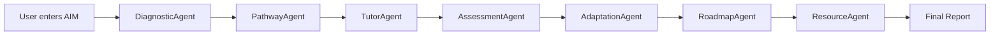

<div align="center">

# Aimify — Diagnose. Map. Master.


**An autonomous multi-agent AI system that diagnoses your knowledge, builds a personalized concept roadmap, teaches you concept by concept, and generates a strategic plan to achieve any learning goal.**

</div>

## What is Aimify?

Have you ever tried to learn a complex topic like "Machine Learning" or "Quantum Mechanics" and felt immediately overwhelmed by *where to start*? Traditional platforms give you static courses that either bore you because they're too slow, or lose you because they assume prerequisites you don't actually have.

Aimify solves this problem through an autonomous, multi-agent architecture. Instead of a one-size-fits-all curriculum, Aimify dynamically reverse-engineers the exact knowledge graph you need to achieve your specific goal. It tests your current baseline to determine *precisely* what you don't know, dynamically generates an optimal learning path (DAG), and then actively tutors you on each node. 

In short: Aimify doesn't just teach you; it figures out **what** to teach you and **how** it should be structured based on your unique gaps.

## Demo GIF / Screenshot
*[placeholder for demo gif - add after recording]*

## How It Works

Aimify employs a highly specialized 7-agent pipeline designed to handle distinct phases of the educational journey. The process flows seamlessly from one expert agent to the next:



## Agent Architecture

| Agent | Role | Model Mode |
|---|---|---|
| **DiagnosticAgent** | Assesses prerequisite knowledge and identifies gaps. | Normal |
| **PathwayAgent** | Builds the concept dependency graph (DAG) tailored to the user. | Thinking |
| **TutorAgent** | Actively teaches the user, concept by concept. | Normal |
| **AssessmentAgent** | Evaluates user understanding objectively via dynamic MCQs. | Normal |
| **AdaptationAgent** | Adjusts the ongoing learning path based on evaluation feedback. | Thinking |
| **RoadmapAgent** | Generates a long-term strategic plan after initial tutoring. | Thinking |
| **ResourceAgent** | Curates external learning resources to supplement weak areas. | Normal |

## Tech Stack

- **Backend:** FastAPI, SQLAlchemy, PostgreSQL
- **Frontend:** React, Vite, Tailwind CSS, Framer Motion, Three.js
- **AI:** Gemini 2.5 Flash (primary), Qwen3-32B via Groq (fallback)
- **Database:** PostgreSQL via Docker

## Quick Start

### Prerequisites
- [Python 3.11+](https://www.python.org/downloads/)
- [Node.js 18+](https://nodejs.org/)
- [Docker Desktop](https://www.docker.com/products/docker-desktop/)

### Setup

```bash
# 1. Clone the repository
git clone https://github.com/YourGithubUsername/aimify.git
cd aimify

# 2. Start the database
docker-compose up -d

# 3. Setup the Backend
cd backend
python -m venv venv
source venv/bin/activate  # On Windows use `venv\Scripts\activate`
pip install -r requirements.txt
cp .env.example .env

# 4. Setup the Frontend (in a new terminal wrapper/tab)
cd ../frontend
npm install
npm run dev

# 5. Run the Backend (back in the backend terminal)
uvicorn main:app --reload --port 8000
```

### API Keys Required

Aimify utilizes powerful LLMs to drive its agents. You will need to populate the following in your `backend/.env` file:

- **Google AI Studio (free):** Get your Gemini API keys at [aistudio.google.com](https://aistudio.google.com/).
- **Groq (free):** Get your Groq API key for the fallback agent at [console.groq.com](https://console.groq.com/).

Update the `GEMINI_API_KEY_1`, `GEMINI_API_KEY_2`, `GEMINI_API_KEY_3`, and `GROQ_API_KEY` placeholders in `backend/.env`.

## Project Structure

```text
aimify/
├── backend/            # FastAPI server and 7-agent LLM pipeline
├── frontend/           # React/Three.js interactive UI
├── docker-compose.yml  # PostgreSQL database configuration
└── (Additional Config)
```

## Features

- **7 Specialized AI Agents:** Distinct roles mimicking an expert human tutoring pipeline.
- **Adaptive MCQ Assessment:** Pure index comparison architecture to ensure zero hallucinatory grading.
- **Dynamic Concept Graph:** Concept ordering as a Directed Acyclic Graph (DAG) adjusting iteratively.
- **Real-Time Agent Activity Feed:** Watch the agents 'think' and 'communicate' via Server-Sent Events (SSE).
- **3D Interactive Visualizations:** Three.js integration for stunning, interactive concept mapping.
- **Personalized Roadmap:** Post-diagnostic long-term strategy with timeline generation.
- **Curated Resource Recommendations:** Specifically targeted external resources for assessed weak areas.
- **Multi-Provider LLM Fallback:** Resilient design switching to Groq (Qwen3) if Gemini limits are hit.
- **Premium Apple-Inspired UI:** Glassmorphism, intuitive UX, and smooth Framer Motion animations.

## Academic Context

Aimify was built as part of the Agentic AI course at **SRM University**.
It implements core concepts from AI state-space search, graph algorithms, and intelligent multi-agent framework orchestration.

## Contributing

We welcome contributions! Please see our [CONTRIBUTING.md](CONTRIBUTING.md) for details on setting up your dev environment, code style guidelines, and the pull request process.

## License

This project is licensed under the MIT License - see the [LICENSE](LICENSE) file for details.
